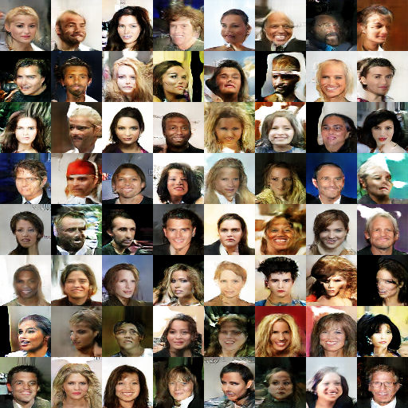
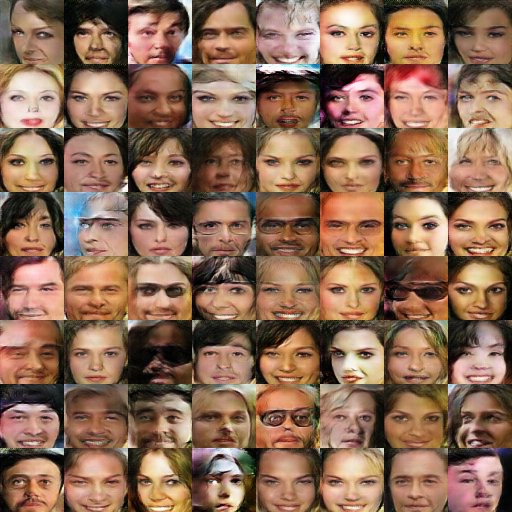
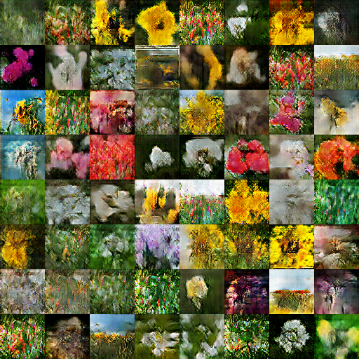

# TensorFlow DCGAN

## Usage
Train a model.  
`$ python main.py --dataset='celeb_a' --height=64 --width=64 output_dir=''`

Options.  

```
  --batch_size: Batch size of images to train.
    (default: '64')
    (an integer)
  --crop: Center crop image.
    (default: 'false')
  --dataset: Dataset to train [cifar10, celeb_a, tf_flowers]
    (default: 'cifar10')
  --epochs: Number of epochs to train.
    (default: '100')
    (an integer)
  --height: Image input height.
    (default: '64')
    (an integer)
  --width: Image input width.
    (default: '64')
    (an integer)
  --learning_rate: Learning rate.
    (default: '0.0002')
    (a number)
  --output_dir: Directory to save output.
    (default: '')
  --cache: Optional: [None, memory, disk]. If specified, data will be cached
    for faster training. 
    memory: slower, disposable. 
    disk: faster, requires space.
    (default: '')
```

## Results
**CelebA**  


**CelebA cropped**  


**TF Flowers** ~3,600 images  


